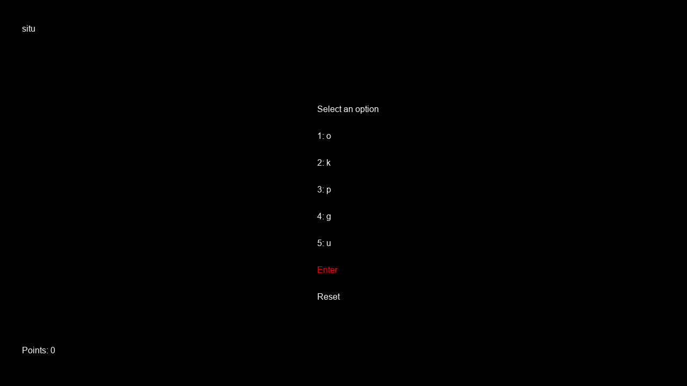

# Vocab

Author: Haidar Jamal

Design: There is a preloaded set of words that comprises of Google's top 20000 word searches and you have to try to come up with one of these words from a set of randomly generated letters. The longer the word (riskier), the larger the reward, with a penalty for wrong guesses or asking to reset. The game looks simple but there's quite a lot going on in the background!

Text Drawing: In this game, every word that needs to be shown on the screen is sent to an instance of DrawWords (similar to DrawLines), which is stored in static memory of the PlayMode (called MenuMode in this game). The word is generated in runtime in this game. DrawWords contains a map that links strings to a vector of a special Character struct. If the map doesn't contain the string, Harfbuzz and Freetype are first used to create a bitmap of each letter in the word. This bitmap is used to generate a texture in OpenGL. The texture and other dimensional information from each letter is stored in a Character, which is pushed back into a vector of Characters, which is inserted to the map. Thus, words are stored only once as needed and are rendered at runtime. I believe this can scale to a reasonable size. The key files are DrawWords.cpp/hpp, MenuMode.cpp/hpp, and game_menu.cpp/hpp.

Screen Shot:

How To Play:

To select a letter hit enter. The word you are generating will appear in the top left corner and your total points go below zero. Points are awarded based on length^2 of each word that is inside the set of pre-loaded Google search words. You can reset at any time for a penalty of one point.

Sources:   
I did not use any assets in this game, but I heavily referenced a few of the following resources:  
harfbuzz: https://harfbuzz.github.io/ch03s03.html  
freetype: https://www.freetype.org/freetype2/docs/tutorial/step1.html  
opengl: https://learnopengl.com/In-Practice/Text-Rendering  
base code: https://github.com/15-466/15-466-f19-base6  
And lastly I would like to thank the 15-466-f20 students/professor for their helpful tips.  

This game was built with [NEST](NEST.md).

